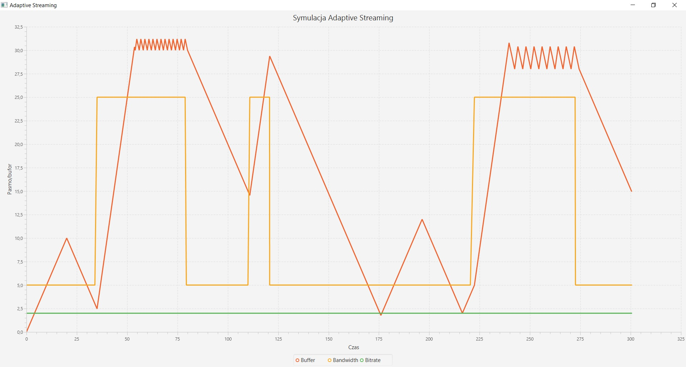

 # Adaptacyjne strumieniowanie (adaptive streaming)
 Symulacja zdarzeniowa strumieniowania pliku audio/wideo w sieci. Rysuje wykresy długości bufora odtwarzania i pokazuje jego ewolucję w czasie w zależności od dostępnego pasma. Program w języku Java z GUI JavaFX.

   

 # Założenia symulacji
 * model klient (player)
 * serwer, jeden strumień
 * zmienność warunków transmisyjnych modelujemy tylko poprzez wolne zmiany pasma dostępnego dla naszej transmisji
 * ulosowione momenty zmiany high/low
 * czasy odstępu relatywnie długie (rozkład wykładniczy)
 * wartości pasma high/low zadane dwuparametrowo
 * symulacja transmisji kolejnych bajtów segmentu w warunkach zmiennego pasma
 * dostępna jest tyko jedna rozdzielczość obrazu(jedna przepływność segmentów)
 * kolejny segment można zacząć ściągać po zakończeniu ściągania poprzedniego segmentu

 # Założenia upraszczające
 * opóźnienie między decyzją o ściągnięciu kolejnego segmentu a gotowością do odtworzenia (ściągnięciem) jego pierwszych bitów jest zerowe (nie modelujemy opóźnień propagacji itp.) - dzięki temu łatwo jest uniknąć całkowitego opróżnieniu bufora odtwarzania.
 * na liście zdarzeń wystarczy pamiętać moment zakończenia odtwarzania aktualnego segmentu

 # TODO
 * ~~Zacząć~~ (Done!)
 * ~~Layout aplikacji~~ (Done!)
 * ~~Symulacja i wykres~~ (Done!)
 * ~~Dowolna wartość bandwidth i dobór bitrate w zależności od niej~~ (Done!)
